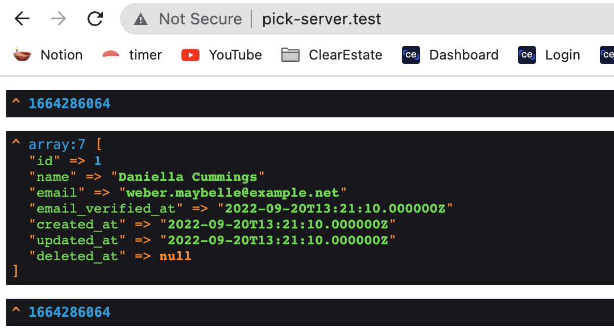

# Sort of `Ray` alternative

Drop `pick()` in you code. `Pick` will pick up anything you pass along and show.

## Installation

You can install the package via composer:

```bash
composer require pkboom/laravel-pick --dev
```

You can publish the config file with

```bash
php artisan vendor:publish --provider="Pkboom\Pick\PickServiceProvider" --tag="pick"
```

## Usage

Download and install `pick server`.

```sh
git clone https://github.com/pkboom/pick-server.git
cd pick-server
composer install
composer setup
```

Spin up `pick server`. Actually we use 'valet'. So server is already up and running.

Open `pick-server.test` and whatever `laravel-pick` sends will appear here.

After installing `pick-server`, use `pick()` in your app.

```php
Route::get('/', function () {
    pick(time());
    pick(User::first());
    pick(time());

    return 'calm down';
});
```

Result at http://pick-server.test



## Testing

```bash
composer test
```
